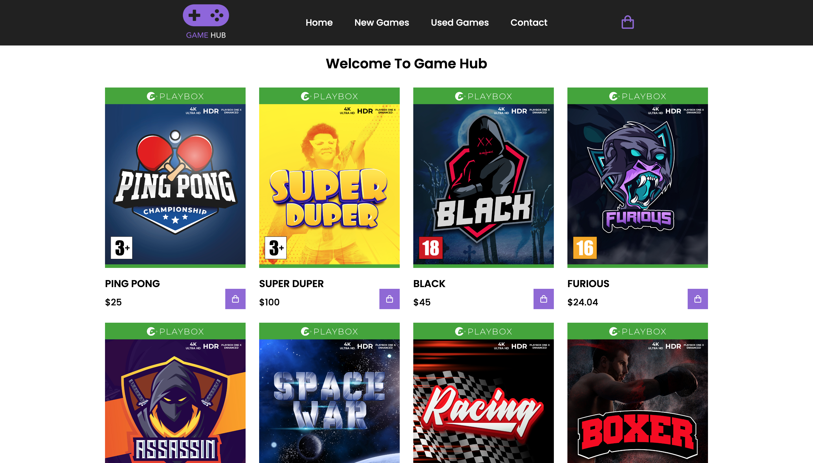

# Interaction Design



Homepage

## Description

This project is a cross-course assigment for my school. In this project i have made an shopping website which has new and used games.

- Homepage
- Games (New and Used) page
- Contact page with requirments
- Working Cart page
- Menu for mobile screens

## Built With

You can list a the tech stack that you've used over here

- HTML
- CSS
- Javascript

## Link
```bash
https://prismatic-bubblegum-a80871.netlify.app/
```

## Getting Started

### Installing

This is where you list how to get the project started. It typically just includes telling a person to clone the repo and then to install the dependencies e.g.

1. Clone the repo:

```bash
git clone git@github.com:piyushsharma1209/Piyush-Sharma-Interaction-Design-CA.git
```

2. Install the dependencies:

```
npm install
```

### Running

Here is where you detail how to run the app. It typically involves the commands you'd need to run to start the project e.g.

To run the app, run the following commands:

```bash
npm run start
```
